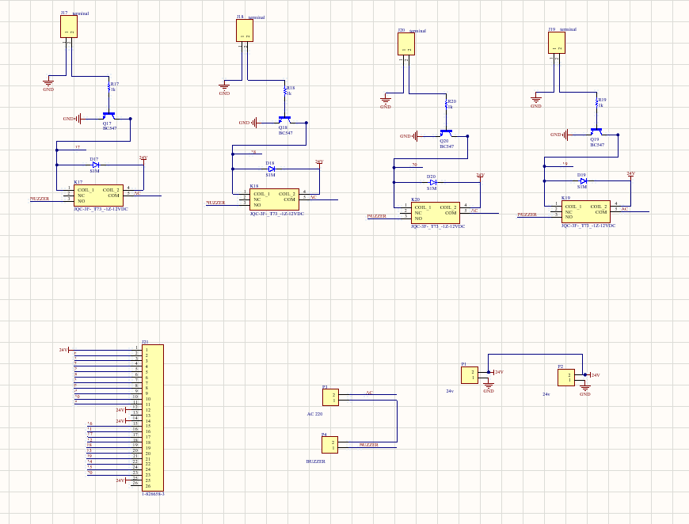
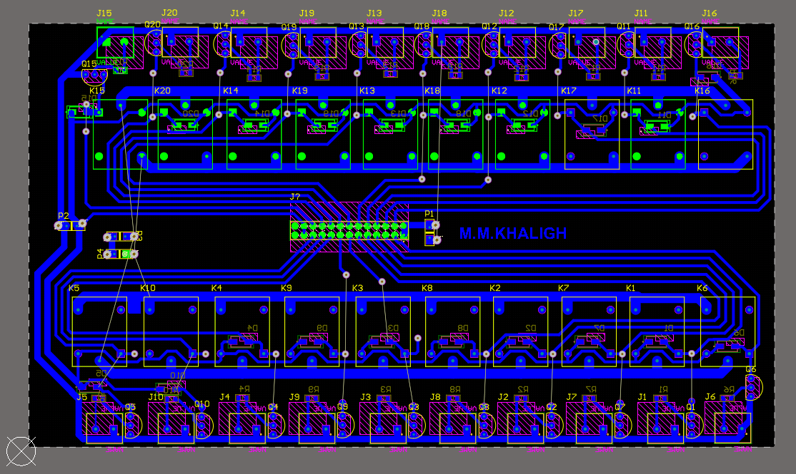

# 20-Channel Relay Module
**Designed by Mohammad Mahadi Khaligh**

This is a 20-channel relay module that uses an analog signal as a detector for PLCs or a simple burglar alarm.

## Features
- Supports up to 20 relays
- Can be used in PLC-based automation
- Suitable for security alarm systems
- Operates with a 24V power supply

## Schematic

## PCB
 

## Usage
- Connect the module to a 24V power source.
- Use analog signals to activate relays.
- Integrate with PLCs or burglar alarm systems.

**Designed by Mohammad Mahadi Khaligh**

To buy a digital version with a microcontroller, contact SIM card and LAN and LCD with the microcontroller code message me or send Email. "Also, the project is sent and installed with the case"
